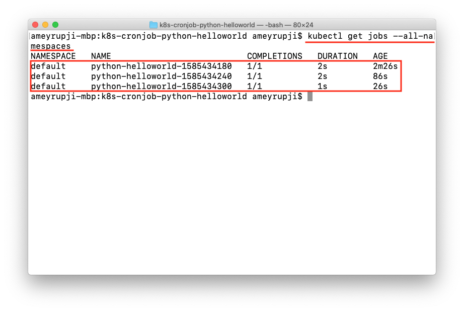

| [◂ Previous](https://github.com/ameyrupji-k8s/docker-python-helloworld) |
|-----|

# k8s-cronjob-python-helloworld

Taking the simple python hello world script further. This example creates a docker container containing a python hello world script thar prints "Hello World!" which gets deployed as a Cronjob to a kubernetes cluster using helm.

To learn more about CronJobs click [here](https://kubernetes.io/docs/concepts/workloads/controllers/cron-jobs/).

**Note:** Refer [docker-python-helloworld](https://github.com/ameyrupji-k8s/docker-python-helloworld) repo.


## Prerequisites

- Python - >=3.5
- Visual Studio Code
- Docker
- Helm
- Tiller on the Kubernetes cluster

## System Configuration at time of test

- macOS Catalina - Version 10.15.3
- Python - Version 3.7.6
- Docker Desktop - Version 2.2.0.4 (43472)
- Kubernetes - v1.15.5
- Helm - v2.14.3

## Initial Setup

### Installing tiller

Run the following commands to install tiller if already not installed on your local cluster.

```sh
kubectl -n default create serviceaccount tiller

kubectl create clusterrolebinding tiller \
  --clusterrole cluster-admin \
  --serviceaccount=default:tiller

helm init --service-account tiller --tiller-namespace default
```

### Creating Python code

Follow the steps outlined in [docker-python-helloworld](https://github.com/ameyrupji-k8s/docker-python-helloworld) GitHub project to create a docker container. 

The basic commands required to create a container are"

```
docker build -t python-helloworld:v1 .
```

### Adding Helm charts

Making the docker container ready to be deployed on kubernetes using helm create the necessary charts by running command `helm create {chart name}` in this case the chart name should be same as the the project name in this case `python-helloworld`. This will create a folder with that name and add default chart templates. Here is the [link](https://helm.sh/docs/helm/helm_create/) to the documentation of the files created.

Look the modified code in the `python-helloworld` directory. Delete the following files `templates/deployment.yaml`, `templates/service.yaml`, `templates/NOTES.txt`, `templates/ingress.yaml`, `templates/tests/test-connection.yaml` and `values.yaml`.

Create a new file `templates/cronjob.yaml` with the following contents:

```
apiVersion: batch/v1beta1
kind: CronJob
metadata:
  name: {{ .Values.cronjob.name }}
  labels:
    app.kubernetes.io/name: {{ .Values.cronjob.name }}
    helm.sh/chart: {{ include "python-helloworld.chart" . }}
spec:
  schedule: "{{ .Values.cronjob.schedule }}"
  jobTemplate:
    spec:
      template:
        spec:
          containers:
          - name: {{ .Chart.Name }}
            image: "{{ .Values.image.repository }}:{{ .Values.image.tag }}"
            args:
            - /bin/sh
            - -c
            - date; echo Hello from the Kubernetes cluster
          restartPolicy: OnFailure
```

Create a new file `values.yaml` with the following contents:

```
image:
  repository: "python-helloworld"
  tag: "v1"
  pullPolicy: IfNotPresent

cronjob:
  name: python-helloworld
  schedule: "*/1 * * * *"
```

Lets understand the schedule in more detail with this illustration:


So for the python CronJob that we have created this will run every min.

### Validate the created charts

To validate the created helm charts run the following command:

`helm lint ./python-helloworld/`


### Run Helm Install

To install the CronJob  using kubernetes run the following command:

`helm install --name python-helloworld -f ./python-helloworld/values.yaml ./python-helloworld/ --tiller-namespace default`

Alternatively you can also use upgrade command with the `--install` flag:


`helm upgrade python-helloworld ./python-helloworld/ -f ./python-helloworld/values.yaml --install --tiller-namespace default`

## Test

### Verify that the CronJob is installed

Verify that the CronJob is installed properly using `helm` using the command 
` helm list --tiller-namespace defaut`


Now using the `kubectl` command `kubectl get pods --all-namespaces`


Alternately using the `kubectl` command `kubectl get jobs --all-namespaces`



This pod is configured to run every one min so trying back after a min you will see two pods in the `Completed` state using command `kubectl get pods --all-namespaces`


### Check Logs

Check run logs `kubectl logs {pod_name} -n default`


### Manually run CronJob

To manually test the CronJob you can use the following command:

`kubectl create job --from=cronjob/python-helloworld python-helloworld-manual-run`

To verify if that CronJob ran successfully run `kubectl get pods --all-namespaces`


## Cleanup

To delete the container that was created use this command: `docker rm {container_id}`


To delete the docker image that was created: `docker rmi python-helloworld:v1`


## Useful Links

- https://medium.com/@pandit.summit/kubernetes-cron-job-with-python-image-in-minikube-windows-10-ac33851d573d
- https://github.com/ameyrupji-k8s/python-helloworld
- https://github.com/ameyrupji-k8s/docker-nginx-static-html-demo
- https://github.com/ameyrupji-k8s/docker-spring-boot-helloworld


| [Next ▸](https://github.com/ameyrupji-k8s/k8s-cronjob-python-helloworld) |
|-----|
